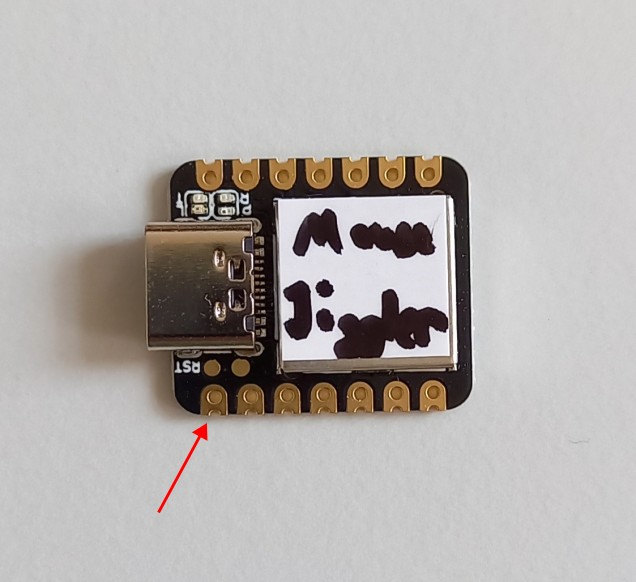

# mouse-jiggler

This repo contains the CircuitPython code (and vendor libraries) required to program the Xiao SAMD21 board as a mouse jiggler.

The main program lives in `code.py`, while `boot.py` is ran as part of the bootloader.

## Setting up a new Xiao

1. Get CircuitPython bootloader in DFU form: https://circuitpython.org/board/seeeduino_xiao/

   Note: for some reason version 9.x is incompatible (wrong HID device). Probably not too hard to fix but for now use 8.2.4 ([direct link](https://adafruit-circuit-python.s3.amazonaws.com/bin/seeeduino_xiao/en_US/adafruit-circuitpython-seeeduino_xiao-en_US-8.2.4.uf2))
1. Enter DFU mode and install CircuitPython: https://wiki.seeedstudio.com/Seeeduino-XIAO-CircuitPython/
1. Your computer should now see a CIRCUITPY external drive
1. Copy the code from this repo into the CIRCUITPY "drive"

## Enabling CIRCUITPY drive

1. The code in `boot.py` disables the firmware storage device by default
1. If you want to enable it again, you have to touch pin 0 with your finger within 10 seconds after connecting the device:

